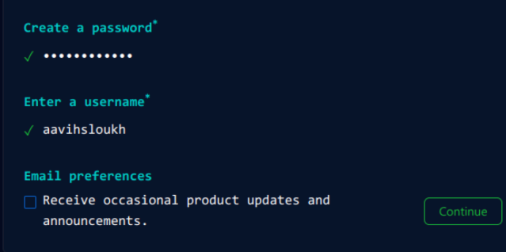
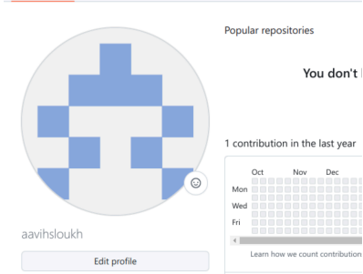
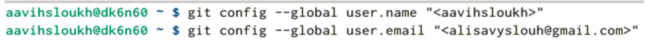
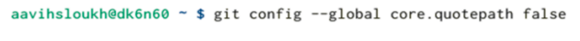
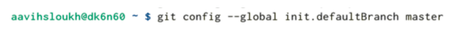

---
## Front matter
title: "Отчет по лабараторной работе №3"
subtitle: "Дисциплина: архитектура компьютеров"
author: "Выслоух Алиса Александровна"

## Generic otions
lang: ru-RU
toc-title: "Содержание"

## Bibliography
bibliography: bib/cite.bib
csl: pandoc/csl/gost-r-7-0-5-2008-numeric.csl

## Pdf output format
toc: true # Table of contents
toc-depth: 2
lof: true # List of figures
lot: true # List of tables
fontsize: 12pt
linestretch: 1.5
papersize: a4
documentclass: scrreprt
## I18n polyglossia
polyglossia-lang:
  name: russian
  options:
	- spelling=modern
	- babelshorthands=true
polyglossia-otherlangs:
  name: english
## I18n babel
babel-lang: russian
babel-otherlangs: english
## Fonts
mainfont: IBM Plex Serif
romanfont: IBM Plex Serif
sansfont: IBM Plex Sans
monofont: IBM Plex Mono
mathfont: STIX Two Math
mainfontoptions: Ligatures=Common,Ligatures=TeX,Scale=0.94
romanfontoptions: Ligatures=Common,Ligatures=TeX,Scale=0.94
sansfontoptions: Ligatures=Common,Ligatures=TeX,Scale=MatchLowercase,Scale=0.94
monofontoptions: Scale=MatchLowercase,Scale=0.94,FakeStretch=0.9
mathfontoptions:
## Biblatex
biblatex: true
biblio-style: "gost-numeric"
biblatexoptions:
  - parentracker=true
  - backend=biber
  - hyperref=auto
  - language=auto
  - autolang=other*
  - citestyle=gost-numeric
## Pandoc-crossref LaTeX customization
figureTitle: "Рис."
tableTitle: "Таблица"
listingTitle: "Листинг"
lofTitle: "Список иллюстраций"
lotTitle: "Список таблиц"
lolTitle: "Листинги"
## Misc options
indent: true
header-includes:
  - \usepackage{indentfirst}
  - \usepackage{float} # keep figures where there are in the text
  - \floatplacement{figure}{H} # keep figures where there are in the text
---

# Цель работы

Изучить идеологию и применение средств контроля версий. При- обрести
практические навыки по работе с системой git. 

# Задание

1. Настройка Github.
2. Базовая настройка Git.
3. Создание SSH-ключа.
4. Создание рабочего пространства и репозитория курса на основе шаблона.
5. Создание репозитория курса на основе шаблона.
6. Настройка каталога курса.
7. Выполнение заданий для самостоятельной работы. 

# Теоретическое введение

Системы контроля версий (Version Control System, VCS) широко
используются при коллективной работе над проектами. Обычно основной набор
файлов проекта хранится в локальном или удаленном хранилище, к которому
имеют доступ участники. VCS позволяет фиксировать изменения, совмещать
их, откатываться к предыдущим версиям проекта.
В классических VCS используется централизованная модель, где есть
единый сервер для хранения файлов и управления версиями. Пользователи
получают нужные версии файлов перед работой и загружают новые версии
после внесения изменений. Сервер может сохранять только изменения между
версиями, что позволяет экономить место. VCS также помогают разрешать
конфликты при работе нескольких пользователей над одним файлом. В
системах контроля версий можно отследить, кто и когда вносил изменения.
Наиболее известные VCS включают CVS, Subversion, Git, Bazaar, Mercurial,
каждая из них имеет свои особенности.
Git, например, работает через командную строку и не требует
центрального хранилища для работы, что делает его более гибким и удобным. 

# Выполнение лабораторной работы

# Настройка GitHub
Создаю учетную запись на GitHub (рис. [-@fig:001]) Далее заполняю основные данные.
{#fig:001 width=70%}

Аккаунт создан. (рис. [-@fig:002]) 
{#fig:002 width=70%}

# Базовая настройка Git.
Ввожу команду git config -global user.name "", указывая свое имя и
команду git config -global user.email "work @mail", указывая в ней мою
электронную почту. (рис.[-@fig:003]).
{#fig:003 width=70%}

Настраиваю utf-8 в выводе сообщений git для корректного отображения
символов (рис.[-@fig:004]).
{#fig:004 width=70%}

Задаю имя «master» для начальной ветки.(рис.[-@fig:005])
{#fig:005 width=70%}

Задаю параметр autocrlf со значением input. (рис.[-@fig:006])
![ параметр autocrlf] (image/p6.png){#fig:006 width=70%}

Задаю параметр safecrlf со значением warn, так Git будет проверять
преобразование на обратимость (рис.[-@fig:007]).
![ параметр autocrlf] (image/p7.png){#fig:007 width=70%}

Для последующей идентификации пользователя на сервере репозиториев
необходимо сгенерировать пару ключей (приватный и открытый). Для этого
ввожу команду ssh-keygen - С "Имя Фамилия, work @email", указывая мое имя
владельца и электронную почту (рис.[-@fig:008])
![Ключ SSH создание] (image/p8.png){#fig:008 width=70%}

Далее загружаю сгенерированный открытый ключ на Github(рис.[-@fig:009]),
предварительно скопировав его в буфер обмена (рис.[-@fig:010])
![Копирование ключа в буфер обмена.] (image/p9.png){#fig:009 width=70%}
![Загрузка ключа на сайт] (image/p10.png){#fig:010 width=70%}

# Создание рабочего пространства и репозитория курса на основе шаблона.
Создаю каталог для дисциплины «Архитектура компьютера» (рис.[-@fig:011])
Через web-интерфейс github создадим репозиторий на основе шаблона,
указав имя study_2024–2025_arh-рс.(рис.[-@fig:012])
![Создание каталога для дисциплины «Архитектура компьютера»] (image/p11.png){#fig:011 width=70%}
![Создание репозитория.] (image/p12.png){#fig:012 width=70%}

Перейдем в каталог курса и скопируем в него созданный репозиторий с
помощью ссылки для клонирования. (рис.[-@fig:013]) (рис.[-@fig:014])
![ Сылка для клонирования] (image/p13.png){#fig:013 width=70%}
![Клонирование репозитория] (image/p14.png){#fig:014 width=70%} 

Перейдем в каталог курса, удалим лишнее с помощью утилиты rm. (рис.[-@fig:015]) Создадим нужные каталоги (рис.[-@fig:016]) и загрузим файлы на сервер (рис.[-@fig:017]).
![Удаление лишних файлов.] (image/p15.png){#fig:015 width=70%}
![создание нужных каталогов] (image/p16.png){#fig:016 width=70%} 
![Загрузка файлов на сервер] (image/p17.png){#fig:017 width=70%}

Проверяю правильность использования введенных команд (рис.[-@fig:018]). 
![Проверка.] (image/p18.png){#fig:018 width=70%}

# Задания для самостоятельной работы.
Создаю каталоги для отчетов по выполнению лабораторных работ. (рис.[-@fig:019])
![Cоздание каталогов..] (image/p19.png){#fig:019 width=70%}

Сохраняю файл отчета по лабораторной работе в соответствующем каталоге. (рис.[-@fig:020]) 
![Сохранение файлов.] (image/p20.png){#fig:020 width=70%} 

Проверяю правильность ввода команд для создания папок. И убеждаюсь в
правильности своих действий. (рис.[-@fig:021]) 
![Проверка] (image/p21.png){#fig:021 width=70%} 

# Выводы

При выполнении данной лабораторной работы я изучила идеологию и
применение средств контроля версий, а также приобрела практические навыки
по работе с системой git. 

# Список литературы{.unnumbered}
1. Архитектура ЭВМ
2. Git - gitattributes Документация

::: {#refs}
:::
