---
## Front matter
title: "Отчет по лабораорной работе № 4"
subtitle: "Дисциплина: архтектура компьютеров"
author: "Выслоух Алиса Александровна"

## Generic otions
lang: ru-RU
toc-title: "Содержание"

## Bibliography
bibliography: bib/cite.bib
csl: pandoc/csl/gost-r-7-0-5-2008-numeric.csl

## Pdf output format
toc: true # Table of contents
toc-depth: 2
lof: true # List of figures
lot: true # List of tables
fontsize: 12pt
linestretch: 1.5
papersize: a4
documentclass: scrreprt
## I18n polyglossia
polyglossia-lang:
  name: russian
  options:
	- spelling=modern
	- babelshorthands=true
polyglossia-otherlangs:
  name: english
## I18n babel
babel-lang: russian
babel-otherlangs: english
## Fonts
mainfont: IBM Plex Serif
romanfont: IBM Plex Serif
sansfont: IBM Plex Sans
monofont: IBM Plex Mono
mathfont: STIX Two Math
mainfontoptions: Ligatures=Common,Ligatures=TeX,Scale=0.94
romanfontoptions: Ligatures=Common,Ligatures=TeX,Scale=0.94
sansfontoptions: Ligatures=Common,Ligatures=TeX,Scale=MatchLowercase,Scale=0.94
monofontoptions: Scale=MatchLowercase,Scale=0.94,FakeStretch=0.9
mathfontoptions:
## Biblatex
biblatex: true
biblio-style: "gost-numeric"
biblatexoptions:
  - parentracker=true
  - backend=biber
  - hyperref=auto
  - language=auto
  - autolang=other*
  - citestyle=gost-numeric
## Pandoc-crossref LaTeX customization
figureTitle: "Рис."
tableTitle: "Таблица"
listingTitle: "Листинг"
lofTitle: "Список иллюстраций"
lotTitle: "Список таблиц"
lolTitle: "Листинги"
## Misc options
indent: true
header-includes:
  - \usepackage{indentfirst}
  - \usepackage{float} # keep figures where there are in the text
  - \floatplacement{figure}{H} # keep figures where there are in the text
---

# Цель работы

Освоение процедуры компиляции и сборки программ, написанных на ассемблере NASM.

# Задание

1. Создание программы Hello world!

2. Работа с транслятором NASM

3. Работа с расширенным синтаксисом командной строки NASM

4. Работа с компоновщиком LD

5. Запуск исполняемого файла

6. Выполнение заданий для самостоятельной работы.

# Теоретическое введение
Основными элементами любой ЭВМ являются центральный процессор, память и периферийные устройства. Эти устройства взаимодействуют через общую шину, к которой они подключены. Физическая шина состоит из множества проводников, соединяющих устройства. В современных компьютерах проводники реализованы как электропроводящие дорожки на материнской плате. Главной задачей процессора является обработка данных и координация работы всех узлов компьютера. Центральный процессор включает следующие компоненты:

- арифметико-логическое устройство (АЛУ) — выполняет арифметические и логические операции, необходимые для обработки информации в памяти;

- устройство управления (УУ) — отвечает за управление и контроль всех компьютерных устройств;

- регистры — сверхбыстрая оперативная память небольшого объема для временного хранения промежуточных результатов выполнения команд; регистры делятся на общего назначения и специальные. Знание о регистрах процессора необходимо для программирования на ассемблере. Большинство команд ассемблерных программ используют регистры как операнды. Все команды часто преобразуют данные, хранящиеся в регистрах, что включает пересылку данных между регистрами и памятью или выполнение арифметических и логических операций. Доступ к регистрам осуществляется по именам, а не по адресам, как к основной памяти. Каждый регистр архитектуры x86 имеет название из 2 или 3 латинских букв. Примеры основных регистров общего назначения:

- RAX, RCX, RDX, RBX, RSI, RDI — 64-битные;

- EAX, ECX, EDX, EBX, ESI, EDI — 32-битные;

- AX, CX, DX, BX, SI, DI — 16-битные;

- AH, AL, CH, CL, DH, DL, BH, BL — 8-битные.

Другим важным компонентом ЭВМ является оперативное запоминающее устройство (ОЗУ). Оно — энергозависимое, быстродействующее запоминающее устройство, обеспечивающее взаимодействие с процессором для хранения текущих программ и данных. ОЗУ состоит из пронумерованных ячеек памяти, адреса которых соответствуют хранимым в них данным. Периферийные устройства ЭВМ включают:

- устройства внешней памяти для долговременного хранения больших объемов данных;

- устройства ввода-вывода для обеспечения взаимодействия ЦП с внешней средой.

Вычислительный процесс ЭВМ основан на принципе программного управления, что предполагает, что задачи решаются как последовательность действий, записанных в программе.

Коды команд представляют собой двоичные комбинации из 0 и 1. У каждого машинного кода есть операционная и адресная части. Операционная часть хранит код команды, а адресная — данные или адреса, необходимые для ее выполнения. При каждом выполнении команды процессор выполняет стандартный набор действий, что называется командным циклом. Этот цикл состоит из следующих этапов:

- формирование адреса следующей команды в памяти;

- считывание кода команды из памяти и ее дешифрация;

- выполнение команды;

- переход к следующей команде.

Язык ассемблера (assembly language, сокращенно asm) — это низкоуровневый, машинно-ориентированный язык. NASM — открытый проект ассемблера, версии которого доступны для различных ОС и который позволяет создавать объектные файлы для этих систем. NASM использует Intel-синтаксис и поддерживает инструкции x86-64.

# Выполнение лабораторной работы

## Создание программы Hello world

Создаю каталог для работы с программами на языке ассемблера NASM. (рис. [-@fig:001]).

{#fig:001 width=70%}

С помощью утилиты cd перемещаюсь в каталог, в котором буду работать (рис. [-@fig:002]).

{#fig:002 width=70%}

Создаю в текущем каталоге пустой текстовый файл hello.asm с помощью команды touch (рис. [-@fig:003])

{#fig:003 width=70%}

Открываю созданный файл в текстовом редакторе gedit и аполняю файл, вставляя в него программу для вывода "Hello word!"(рис. [-@fig:004]).

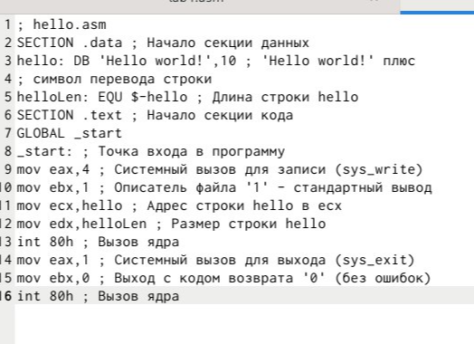{#fig:004 width=70%}

## Работа с транслятором NASM
Я преобразую текст программы для вывода "Hello world!" в объектный код с помощью транслятора NASM, используя команду nasm -f elf hello.asm. Параметр -f сообщает транслятору nasm, что необходимо создать бинарный файл в формате ELF (рис. [-@fig:005]). Затем я проверяю успешность выполнения команды с помощью утилиты ls и вижу, что файл "hello.o" действительно создан.(рис. [-@fig:006])

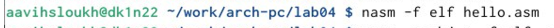{#fig:005 width=70%}

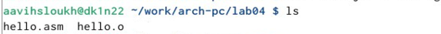{#fig:006 width=70%}

## Работа с расширенным синтаксисом командной строки NASM
Ввожу команду, которая скомпилирует файл hello.asm в файл obj.o, при этом в файл будут включены символы для отладки (ключ -g), также с помощью ключа -l будет создан файл листинга list.lst (рис. [-@fig:007]). Далее проверяю с помощью утилиты ls правильность выполнения команды.

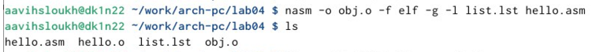{#fig:007 width=70%}

## Работа с компоновщиком LD

Передаю объектный файл hello.o на обработку компоновщику LD, чтобы получить исполняемый файл hello (рис. [-@fig:008]). Ключ -о задает имя создаваемого исполняемого файла. Далее проверяю с помощью утилиты ls правильность выполнения команды.

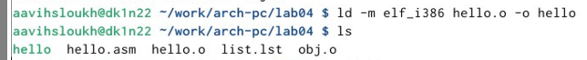{#fig:008 width=70%}

## Запуск исполняемого файла

Запускаю на выполнение созданный исполняемый файл hello (рис. [-@fig:009]).

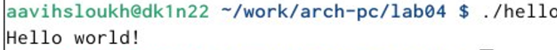{#fig:009 width=70%}

# Задания для самостояельной работы

С помощью утилиты cp создаю в текущем каталоге копию файла hello.asm с именем lab4.asm (рис. [-@fig:010]).

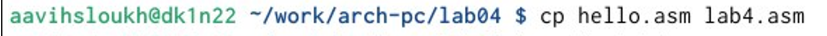{#fig:010 width=70%}

С помощью текстового редактора gedit открываю файл lab4.asm и вношу изменения в программу так, чтобы она выводила мои имя и фамилию (рис. [-@fig:011]).

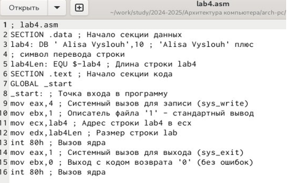{#fig:011 width=70%}

Компилирую текст программы в объектный файл. Проверяю с помощью утилиты ls, что файл lab4.o создан (рис. [-@fig:012]).

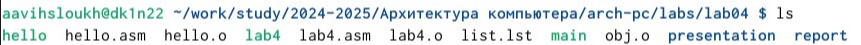{#fig:012 width=70%}

Передаю объектный файл lab4.o на обработку компоновщику LD, чтобы получить исполняемый файл lab4 (рис. [-@fig:013]).

{#fig:013 width=70%}

Запускаю исполняемый файл lab5, на экран действительно выводятся мои имя и фамилия (рис. [-@fig:014]).

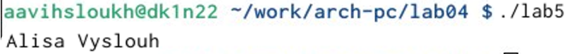{#fig:014 width=70%}

Копирую папку и соединяю ее с lab04. Удаляю лишние файлы после копирования и проверяю с помощью утилиты ls.(рис. [-@fig:015]). 

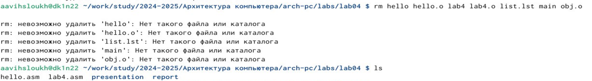{#fig:015 width=70%}

Ввожу последовательность команд git add . git commit и git push.(рис. [-@fig:016]).
 
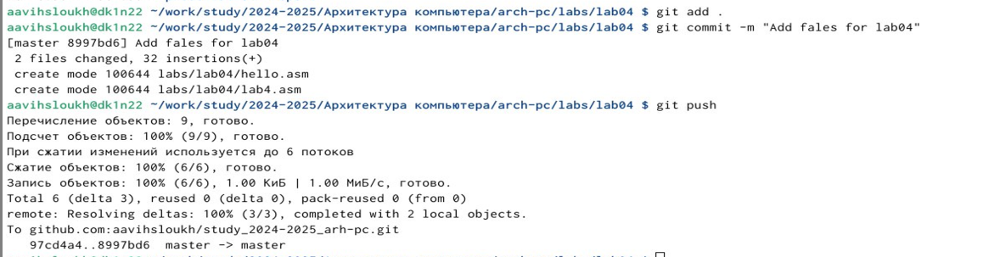{#fig:016 width=70%}

# Выводы

При выполнении данной лабораторной работы я освоила процедуры компиляции и сборки программ, написанных на ассемблере NASM.

