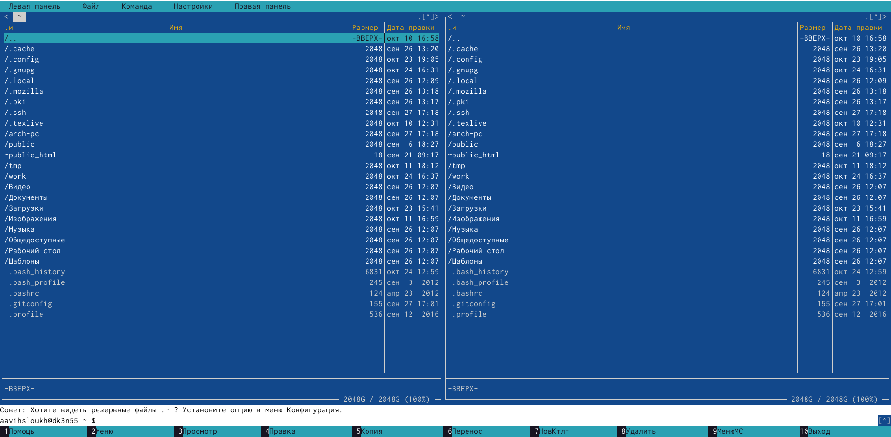
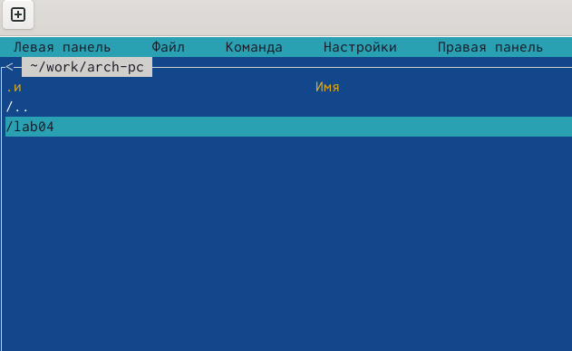
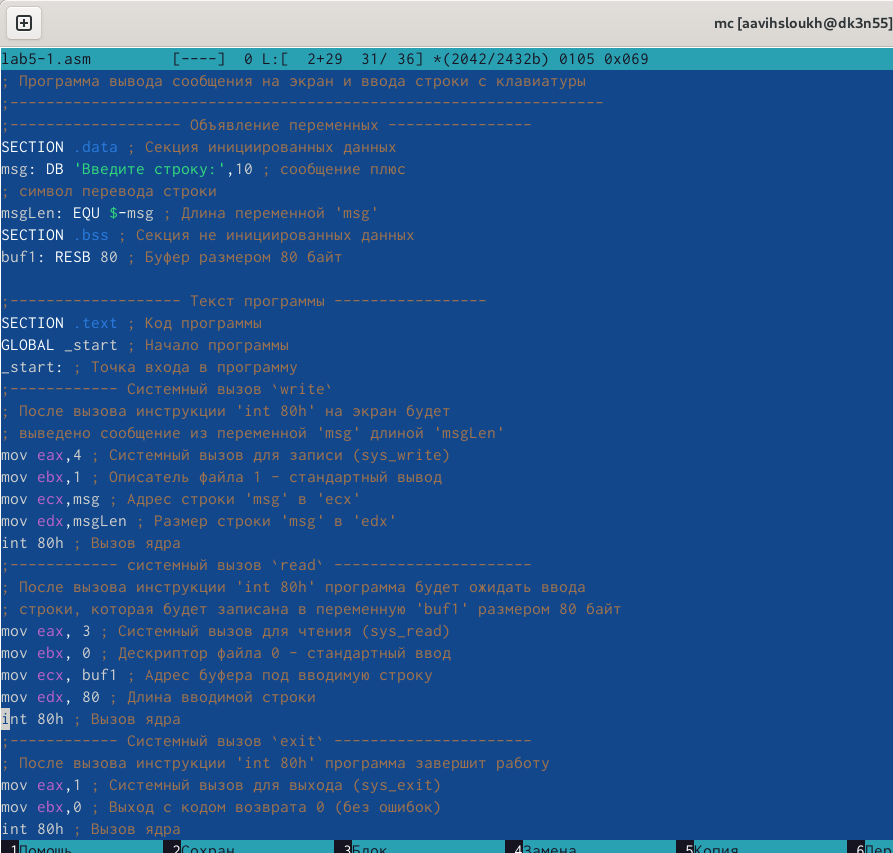
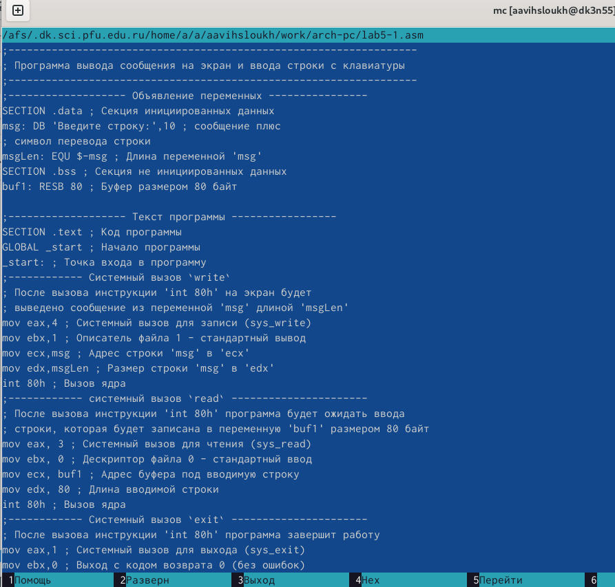
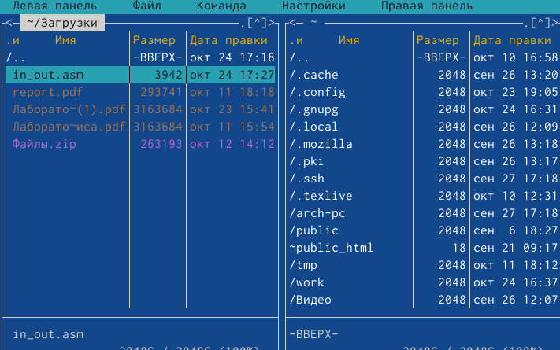
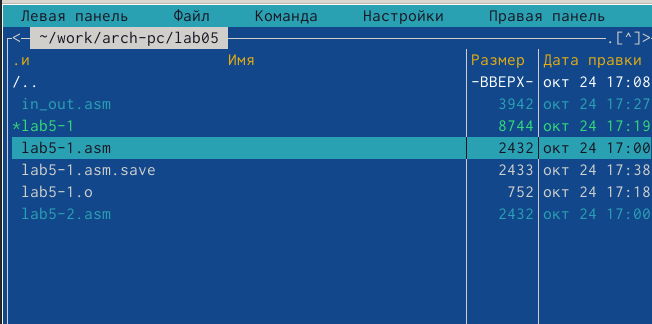
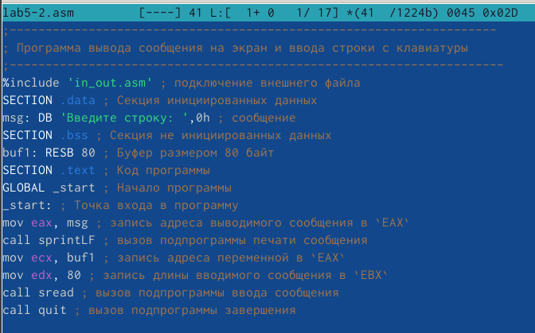
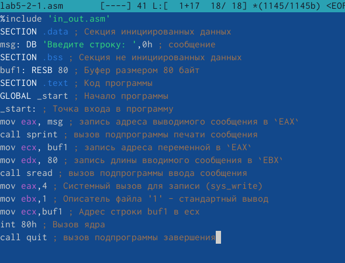

---
## Front matter
title: "Отчет по лабораторной работе № 5"
subtitle: "Дисциплина: архитектура компьютера"
author: "Выслоух Алиса Александровна"

## Generic otions
lang: ru-RU
toc-title: "Содержание"

## Bibliography
bibliography: bib/cite.bib
csl: pandoc/csl/gost-r-7-0-5-2008-numeric.csl

## Pdf output format
toc: true # Table of contents
toc-depth: 2
lof: true # List of figures
lot: true # List of tables
fontsize: 12pt
linestretch: 1.5
papersize: a4
documentclass: scrreprt
## I18n polyglossia
polyglossia-lang:
  name: russian
  options:
	- spelling=modern
	- babelshorthands=true
polyglossia-otherlangs:
  name: english
## I18n babel
babel-lang: russian
babel-otherlangs: english
## Fonts
mainfont: IBM Plex Serif
romanfont: IBM Plex Serif
sansfont: IBM Plex Sans
monofont: IBM Plex Mono
mathfont: STIX Two Math
mainfontoptions: Ligatures=Common,Ligatures=TeX,Scale=0.94
romanfontoptions: Ligatures=Common,Ligatures=TeX,Scale=0.94
sansfontoptions: Ligatures=Common,Ligatures=TeX,Scale=MatchLowercase,Scale=0.94
monofontoptions: Scale=MatchLowercase,Scale=0.94,FakeStretch=0.9
mathfontoptions:
## Biblatex
biblatex: true
biblio-style: "gost-numeric"
biblatexoptions:
  - parentracker=true
  - backend=biber
  - hyperref=auto
  - language=auto
  - autolang=other*
  - citestyle=gost-numeric
## Pandoc-crossref LaTeX customization
figureTitle: "Рис."
tableTitle: "Таблица"
listingTitle: "Листинг"
lofTitle: "Список иллюстраций"
lotTitle: "Список таблиц"
lolTitle: "Листинги"
## Misc options
indent: true
header-includes:
  - \usepackage{indentfirst}
  - \usepackage{float} # keep figures where there are in the text
  - \floatplacement{figure}{H} # keep figures where there are in the text
---

# Цель работы

Приобреcnb практические навыки работы в Midnight Commander. Освоить инструкции
языка ассемблера mov и int.

# Задание

1. Основы работы с mc

2. Структура программы на языке ассемблера NASM

3. Подключение внешнего файла

4. Выполнение заданий для самостоятельной работы

# Теоретическое введение

Midnight Commander (или просто mc) — это программа, которая предоставляет возможность просматривать структуру каталогов и выполнять основные операции управления файловой системой, то есть mc является файловым менеджером. Midnight Commander упрощает работу с файлами, делая её более удобной и наглядной. Программа на языке ассемблера NASM обычно состоит из трёх секций: секция кода программы (SECTION .text), секция инициализированных данных (SECTION .data), известная на этапе компиляции, и секция неинициализированных данных (SECTION .bss), для которых память отводится во время компиляции, но значения присваиваются в ходе выполнения программы. Для объявления инициализированных данных в секции .data используются директивы DB, DW, DD, DQ и DT, которые резервируют память и указывают, какие значения будут храниться в этой памяти:

- DB (define byte) — определяет переменную размером в 1 байт;

- DW (define word) — определяет переменную размером в 2 байта (слово);

- DD (define double word) — определяет переменную размером в 4 байта (двойное слово);

- DQ (define quad word) — определяет переменную размером в 8 байт (учетверённое слово);

- DT (define ten bytes) — определяет переменную размером в 10 байт.

Эти директивы применяются для объявления простых переменных и массивов. Для определения строк обычно используется директива DB из-за особенностей хранения данных в оперативной памяти. Инструкция языка ассемблера mov предназначена для копирования данных из источника в приёмник.

# Выполнение лабораторной работы

## Основы работы с mc

Открываю Midnight Commander, введя в терминал mc (рис. [-@fig:001]).

{#fig:001 width=70%}

Перехожу в каталог ~/work/arch-pc , используя файловый менеджер mc (рис. [-@fig:002])

{#fig:002 width=70%}

С помощью функциональной клавиши F7 создаю каталог lab05 (рис. [-@fig:003]).

{#fig:003 width=70%}

Вижу, что каталог создан (рис. [-@fig:004]).

{#fig:004 width=70%}

Захожу в каталог и в строке ввода прописываю команду touch lab5-1.asm, чтобы создать файл, в котором буду работать (рис. [-@fig:005]).

{#fig:005 width=70%}

## Структура программы на языке ассемблера NASM

С помощью функциональной клавиши F4 открываю созданный файл в редакторе mcedit и ввожу в файл код программы (рис. [-@fig:006]).

{#fig:006 width=70%}

С помощью функциональной клавиши F3 открываю файл для просмотра, чтобы проверить, содержит ли файл текст программы (рис. [-@fig:007]).

{#fig:007 width=70%}

Транслирую текст программы файла в объектный файл командой nasm -f elf lab5-1.asm. Создался объектный файл lab5-1.o. Выполняю компоновку объектного файла с помощью команды ld -m elf_i386 -o lab5-1 lab5-1.o (рис. [-@fig:008]). Создался исполняемый файл lab5-1.

{#fig:008 width=70%}

Запускаю исполняемый файл. И ввожу свое фио (рис. [-@fig:009]).

{#fig:009 width=70%}

## Подключение внешнего файла

Скачиваю файл in_out.asm со страницы курса в ТУИС. Он сохранился в каталог "Загрузки" (рис. [-@fig:010]).

{#fig:010 width=70%} 

С помощью функциональной клавиши F5 копирую файл in_out.asm из каталога Загрузки в созданный каталог lab05 (рис. [-@fig:011]).

{#fig:011 width=70%} 

С помощью функциональной клавиши F5 копирую файл lab5-1 в тот же каталог, но с именем lab5-2 (рис. [-@fig:012]).

{#fig:012 width=70%} 

Изменяю содержимое файла lab5-2.asm во встроенном редакторе mcedit (рис. [-@fig:013]), чтобы в программе использовались подпрограммы из внешнего файла in_out.asm.

{#fig:013 width=70%} 

Я транслирую текст программы из файла в объектный файл, используя команду nasm -f elf lab5-2.asm. В результате был создан объектный файл lab5-2.o. Затем выполняю компоновку объектного файла с помощью команды ld -m elf_i386 -o lab5-2 lab5-2.o, в результате чего создаётся исполняемый файл lab5-2. Запускаю исполняемый файл (рис. [-@fig:014]).

{#fig:014 width=70%} 

Открываю файл lab6-2.asm для редактирования с помощью текстового редактора nano, нажав функциональную клавишу F4. Вношу изменения в подпрограмму sprintLF, переименовывая её в sprint. После этого сохраняю изменения и открываю файл для просмотра, чтобы убедиться, что все изменения были сохранены корректно (рис. [-@fig:015]).

{#fig:015 width=70%} 

Снова транслирую файл, выполняю компоновку созданного объектного файла, запускаю новый исполняемый файл (рис. [-@fig:016]).

{#fig:016 width=70%} 

Разница между первым исполняемым файлом lab5-2 и вторым lab5-2-2 заключается в том, что при запуске первого файла программа запрашивает ввод с новой строки, в то время как программа во втором файле запрашивает ввод без переноса на новую строку. Это различие обусловлено изменениями в подпрограммах sprintLF и sprint: первая добавляет перенос строки после запроса ввода, а вторая — нет.

# Выполнение заданий для самостоятельной работы

Создаю копию файла lab6-1.asm с именем lab6-1-1.asm с помощью функциональной клавиши F5 (рис. [-@fig:017])

{#fig:017 width=70%} 

С помощью функциональной клавиши F4 открываю созданный файл для редактирования. Изменяю программу так, чтобы кроме вывода приглашения и запроса ввода, она выводила вводимую пользователем строку (рис. [-@fig:018]).

{#fig:018 width=70%} 

Создаю объектный файл lab5-1-1.o и передаю его на обработку компоновщику. После компоновки получаю исполняемый файл lab5-1-1. Запускаю полученный исполняемый файл. Программа запрашивает ввод, куда я ввожу свои ФИО, после чего программа выводит введенные мною данные (рис. [-@fig:019]).

{#fig:019 width=70%}

Создаю копию файла lab5-2.asm с именем lab6-2-1.asm с помощью функциональной клавиши F5, открываю файл с помощью клавиши F4 и изменяю ее так, чтобы кроме вывода приглашения и запроса ввода, программа выводила пользовательскую строку (рис. [-@fig:020]). 

{#fig:020 width=70%} 

Проверяю аналогично предыдущему (рис. [-@fig:021]).

{#fig:021 width=70%}

# Выводы

При выполнении данной лабораторной работы я приобрела практические навыки работы в Midnight Commander, а также освоила инструкции языка ассемблера mov и int.

