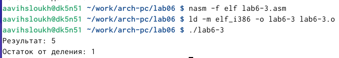

---
## Front matter
title: "Отчет по лабораторной работе № 6"
subtitle: "Дисциплина: архитектура компьютера"
author: "Выслоух Алиса Александровна"

## Generic otions
lang: ru-RU
toc-title: "Содержание"

## Bibliography
bibliography: bib/cite.bib
csl: pandoc/csl/gost-r-7-0-5-2008-numeric.csl

## Pdf output format
toc: true # Table of contents
toc-depth: 2
lof: true # List of figures
lot: true # List of tables
fontsize: 12pt
linestretch: 1.5
papersize: a4
documentclass: scrreprt
## I18n polyglossia
polyglossia-lang:
  name: russian
  options:
	- spelling=modern
	- babelshorthands=true
polyglossia-otherlangs:
  name: english
## I18n babel
babel-lang: russian
babel-otherlangs: english
## Fonts
mainfont: IBM Plex Serif
romanfont: IBM Plex Serif
sansfont: IBM Plex Sans
monofont: IBM Plex Mono
mathfont: STIX Two Math
mainfontoptions: Ligatures=Common,Ligatures=TeX,Scale=0.94
romanfontoptions: Ligatures=Common,Ligatures=TeX,Scale=0.94
sansfontoptions: Ligatures=Common,Ligatures=TeX,Scale=MatchLowercase,Scale=0.94
monofontoptions: Scale=MatchLowercase,Scale=0.94,FakeStretch=0.9
mathfontoptions:
## Biblatex
biblatex: true
biblio-style: "gost-numeric"
biblatexoptions:
  - parentracker=true
  - backend=biber
  - hyperref=auto
  - language=auto
  - autolang=other*
  - citestyle=gost-numeric
## Pandoc-crossref LaTeX customization
figureTitle: "Рис."
tableTitle: "Таблица"
listingTitle: "Листинг"
lofTitle: "Список иллюстраций"
lotTitle: "Список таблиц"
lolTitle: "Листинги"
## Misc options
indent: true
header-includes:
  - \usepackage{indentfirst}
  - \usepackage{float} # keep figures where there are in the text
  - \floatplacement{figure}{H} # keep figures where there are in the text
---

# Цель работы

Цель данной лабораторной работы - освоение арифметческих инструкций языка ассемблера NASM.

# Задание

1. Символьные и численные данные в NASM

2. Выполнение арифметических операций в NASM

3. Выполнение заданий для самостоятельной работы

# Теоретическое введение

Большинство инструкций на языке ассемблера требуют обработки операндов, и адрес операнда указывает на место хранения данных, подлежащих обработке. Эти данные могут находиться как в регистрах, так и в ячейках памяти.Регистровая адресация подразумевает, что операнды хранятся в регистрах, а в команде используются их имена. Например: mov ax, bx. В случае непосредственной адресации значение операнда задается прямо в команде, как в примере: mov ax, 2 . Адресация памяти предполагает, что операнд указывает адрес в памяти. В команде указывается символическое обозначение ячейки памяти, с которой нужно выполнять операцию.Ввод информации с клавиатуры и вывод на экран производятся в символьном формате. Кодирование этих данных осуществляется на основе таблицы символов ASCII. ASCII (American Standard Code for Information Interchange) представляет собой стандарт, по которому каждый символ кодируется одним байтом. Важно отметить, что в NASM нет инструкции, которая могла бы непосредственно выводить числа (не в символьном представлении). Поэтому, чтобы отобразить число на экране, его нужно сначала преобразовать в соответствующие коды ASCII. Если попытаться вывести число напрямую, экран воспримет его не как число, а как последовательность ASCII-символов; каждый байт числа будет интерпретирован как отдельный ASCII-символ.Аналогичная ситуация наблюдается при вводе данных с клавиатуры: введенные символы будут интерпретированы как текст, что затруднит выполнение арифметических операций с ними. Для решения этой проблемы необходимо осуществлять преобразование ASCII-символов в числа и наоборот.

# Выполнение лабораторной работы

## Символьные и численные данные в NASM

Создаю папку lab6 и перехожу в нее. (рис. [-@fig:001]).

{#fig:001 width=70%}

С помощью утилиты touch создаю файл lab6-1.asm (рис. [-@fig:002]).

{#fig:002 width=70%}

Открываю созданный файл lab7-1.asm, вставляю в него программу вывода значения регистра eax (рис. [-@fig:003]).

{#fig:003 width=70%}

Создаю исполняемый файл программы и запускаю его (рис. [-@fig:004]). Вывод программы: символ j.

{#fig:004 width=70%}

Изменяю в тексте программы символы "6" и "4" на цифры 6 и 4 (рис. [-@fig:005]).

{#fig:005 width=70%}

Создаю новый исполняемый файл программы и запускаю его (рис. [-@fig:006]). Теперь вывелся символ перевода строки.

{#fig:006 width=70%}

Создаю новый файл lab6-2.asm с помощью утилиты touch (рис. [-@fig:007]).

{#fig:007 width=70%}

Ввожу в файл текст другойпрограммы для вывода значения регистра eax (рис. [-@fig:008]).

{#fig:008 width=70%}

Создаю и запускаю исполняемый файл lab7-2 (рис. [-@fig:009]). Теперь вывод число 106.

{#fig:009 width=70%}

Заменяю в тексте программы в файле lab7-2.asm символы "6" и "4" на числа 6 и 4 (рис. [-@fig:010]).

{#fig:010 width=70%}

Создаю и запускаю новый исполняемый файл (рис. [-@fig:011]).. Теперь программа складывает не соответствующие символам коды в системе ASCII, а сами числа, поэтому вывод 10.

{#fig:011 width=70%}

Заменяю в тексте программы функцию iprintLF на iprint. Вывод не изменился, потому что символ переноса строки не отображался, когда программа исполнялась с функцией iprintLF, а iprint не добавляет к выводу символ переноса строки, в отличие от iprintLF. 

## Выполнение арифметических операций в NASM

Создаю файл lab7-3.asm с помощью утилиты touch (рис. [-@fig:012]).

{#fig:012 width=70%}

Ввожу в созданный файл текст программы для вычисления значения выражения f(x) = (5 * 2 + 3)/3 (рис. [-@fig:013]).

{#fig:013 width=70%}

Создаю исполняемый файл и запускаю его (рис. [-@fig:014]).

{#fig:014 width=70%}

Изменяю программу так, чтобы она вычисляла значение выражения f(x) = (4 * 6 + 2)/5 (рис. [-@fig:015]).

{#fig:015 width=70%}

Создаю и запускаю новый исполняемый файл (рис. [-@fig:016]). Я посчитала для проверки правильности работы программы значение выражения самостоятельно, программа отработала верно.

{#fig:016 width=70%}

Создаю файл variant.asm с помощью утилиты touch (рис. [-@fig:017]).

{#fig:017 width=70%}

Ввожу в файл текст программы для вычисления варианта задания по номеру студенческого билета (рис. [-@fig:018]).

{#fig:018 width=70%}

Создаю и запускаю исполняемый файл (рис. [-@fig:019]). Ввожу номер своего студ. билета с клавиатуры, программа вывела, что мой вариант - 19.

{#fig:019 width=70%}

## Выполнение заданий для самостоятельной работы

Создаю файл lab7-4.asm с помощью утилиты touch (рис. [-@fig:020]).

{#fig:020 width=70%}

Открываю созданный файл для редактирования, ввожу в него текст программы для вычисления значения выражения (11 + x) * 2 - 6 (рис. [-@fig:021]). Это выражение было под вариантом 8.

{#fig:021 width=70%}

Создаю и запускаю исполняемый файл (рис. [-@fig:022]). При вводе значения 2, вывод 20.

{#fig:022 width=70%}

# Выводы

При выполнении данной лабораторной работы я освоила арифметические инструкции языка ассемблера NASM.

