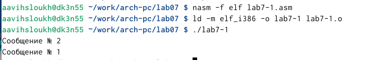

---
## Front matter
title: "Лабораторная работа №7"
subtitle: "Дисциплина: архитектура компьютера"
author: "Выслоух Алиса Александровна"

## Generic otions
lang: ru-RU
toc-title: "Содержание"

## Bibliography
bibliography: bib/cite.bib
csl: pandoc/csl/gost-r-7-0-5-2008-numeric.csl

## Pdf output format
toc: true # Table of contents
toc-depth: 2
lof: true # List of figures
lot: true # List of tables
fontsize: 12pt
linestretch: 1.5
papersize: a4
documentclass: scrreprt
## I18n polyglossia
polyglossia-lang:
  name: russian
  options:
	- spelling=modern
	- babelshorthands=true
polyglossia-otherlangs:
  name: english
## I18n babel
babel-lang: russian
babel-otherlangs: english
## Fonts
mainfont: IBM Plex Serif
romanfont: IBM Plex Serif
sansfont: IBM Plex Sans
monofont: IBM Plex Mono
mathfont: STIX Two Math
mainfontoptions: Ligatures=Common,Ligatures=TeX,Scale=0.94
romanfontoptions: Ligatures=Common,Ligatures=TeX,Scale=0.94
sansfontoptions: Ligatures=Common,Ligatures=TeX,Scale=MatchLowercase,Scale=0.94
monofontoptions: Scale=MatchLowercase,Scale=0.94,FakeStretch=0.9
mathfontoptions:
## Biblatex
biblatex: true
biblio-style: "gost-numeric"
biblatexoptions:
  - parentracker=true
  - backend=biber
  - hyperref=auto
  - language=auto
  - autolang=other*
  - citestyle=gost-numeric
## Pandoc-crossref LaTeX customization
figureTitle: "Рис."
tableTitle: "Таблица"
listingTitle: "Листинг"
lofTitle: "Список иллюстраций"
lotTitle: "Список таблиц"
lolTitle: "Листинги"
## Misc options
indent: true
header-includes:
  - \usepackage{indentfirst}
  - \usepackage{float} # keep figures where there are in the text
  - \floatplacement{figure}{H} # keep figures where there are in the text
---

# Цель работы

Изучение команд условного и безусловного переходов. Приобретение навыков написания программ с использованием переходов. Знакомство с назначением и структурой файла листинга.

# Задание

1. Реализация переходов в NASM.

2. Изучение структуры файлы листинга.

3. Задание для самостоятельной работы.

# Выполнение лабораторной работы

## Реализация переходов в NASM.

Создаю папку lab7, перехожу в нее и создаю файл для работы (рис. [-@fig:001]).

{#fig:001 width=70%}

Ввожу программу из листинга 7.1 в созданный файл (рис. [-@fig:002]).

{#fig:002 width=70%}

Создаю и исполняю файл и запускаю его(рис. [-@fig:003]).

{#fig:003 width=70%}

Ввожу измененный текст программы из листинга 7.2 (рис. [-@fig:004]). 

{#fig:004 width=70%}

 Создаю и исполняю файл и запускаю его(рис. [-@fig:005]).

{#fig:005 width=70%}

Создаю новый файл для работы 7-2 и вставляю в него текст из листинга 3 (рис. [-@fig:006]). 

{#fig:006 width=70%}

Создаю, исполняю и запускаю файл, вводя разные значения В. Я вводила значения 2 и 56 (рис. [-@fig:007]).

{#fig:007 width=70%}

## Изучение структуры файлы листинга.
 Получаю файл листинга, указав ключ -l и задав имя файла листинга в командной строке. (рис. [-@fig:008]).

{#fig:008 width=70%}

Проанализировав файл, я поняла как он работает и какие значения выводит.Первая строка, которую я выбрала находится на 21 месте, ее адрес "00000101", Машинный код - В8 [0A000000], а mov eax,B - исходный текст программы, означающий что в регистр eax мы вносим значения переменной B.
(рис. [-@fig:009]). 

{#fig:009 width=70%}

Вторая строка находится на 38 месте, ее адрес "00000106", Машинный код - E891FFFFFF, а call atoi - исходный текст программы, означающий что символ лежащий в строке выше переводится в число. (рис. [-@fig:010]).

{#fig:010 width=70%}

Третья строка находится на 50 месте, ее адрес "00000162", Машинный код - A1[00000000], а mov eax,[max] - исходный текст программы, означающий что число хранившееся в переменной max записывается в регистр eax. (рис. [-@fig:011]).

{#fig:011 width=70%}

## Задание для самостоятельной работы.
Создаю файл 7-3 и пишу программу для нахождения меньшего из введенных чисел. (рис. [-@fig:012]). 

{#fig:012 width=70%}

Создаю, исполняю и запуска файл. Ввожу числа из моего варианта. Мой вариант 19. Программа написано верно. (рис. [-@fig:013]). 

{#fig:013 width=70%}

Я написала программу, чтобы она вычисляла выражение при введенных Х и А. Для большего удобства, выражение которое будет вычисляться я вывожу вначале работы программы. (рис. [-@fig:014]). 

{#fig:014 width=70%}

Создаю, исполняю и запускаю созданный файл, прверяю работу на числах 1 и 2. (рис. [-@fig:015]). 

{#fig:015 width=70%}

# Выводы

Я изучила команды условного и безусловного перехода. Приобрела навыки написания программ с переходами.

