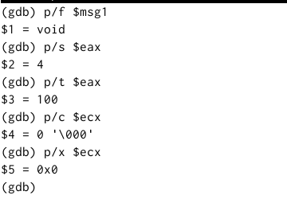
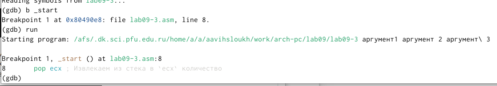

---
## Front matter
title: "Отчет по лабораторной работе № 9"
subtitle: "Дисциплина: архитектура компьютера"
author: "Выслоух Алиса Александровна"

## Generic otions
lang: ru-RU
toc-title: "Содержание"

## Bibliography
bibliography: bib/cite.bib
csl: pandoc/csl/gost-r-7-0-5-2008-numeric.csl

## Pdf output format
toc: true # Table of contents
toc-depth: 2
lof: true # List of figures
lot: true # List of tables
fontsize: 12pt
linestretch: 1.5
papersize: a4
documentclass: scrreprt
## I18n polyglossia
polyglossia-lang:
  name: russian
  options:
	- spelling=modern
	- babelshorthands=true
polyglossia-otherlangs:
  name: english
## I18n babel
babel-lang: russian
babel-otherlangs: english
## Fonts
mainfont: IBM Plex Serif
romanfont: IBM Plex Serif
sansfont: IBM Plex Sans
monofont: IBM Plex Mono
mathfont: STIX Two Math
mainfontoptions: Ligatures=Common,Ligatures=TeX,Scale=0.94
romanfontoptions: Ligatures=Common,Ligatures=TeX,Scale=0.94
sansfontoptions: Ligatures=Common,Ligatures=TeX,Scale=MatchLowercase,Scale=0.94
monofontoptions: Scale=MatchLowercase,Scale=0.94,FakeStretch=0.9
mathfontoptions:
## Biblatex
biblatex: true
biblio-style: "gost-numeric"
biblatexoptions:
  - parentracker=true
  - backend=biber
  - hyperref=auto
  - language=auto
  - autolang=other*
  - citestyle=gost-numeric
## Pandoc-crossref LaTeX customization
figureTitle: "Рис."
tableTitle: "Таблица"
listingTitle: "Листинг"
lofTitle: "Список иллюстраций"
lotTitle: "Список таблиц"
lolTitle: "Листинги"
## Misc options
indent: true
header-includes:
  - \usepackage{indentfirst}
  - \usepackage{float} # keep figures where there are in the text
  - \floatplacement{figure}{H} # keep figures where there are in the text
---

# Цель работы

Приобретение навыков написания программ с использованием подпрограмм. Знакомство с методами отладки при помощи GDB и его основными возможностями

# Задание

1. Реализация переходов в NASM.

2. Изучение структуры файлы листинга.

3. Задание для самостоятельной работы.

# Выполнение лабораторной работы

## Реализация подпрограмм в NASM

Я создала каталог lab09 и создала файл lab09-1.asm (рис. [-@fig:001]).

{#fig:001 width=70%}

Я ввела текст листинга в файл и запустила программу (рис. [-@fig:002]) (рис. [-@fig:003]).

{#fig:002 width=70%}

{#fig:003 width=70%}

Я изменила текст программы, чтобы она решала выражение f(g(x)). (рис. [-@fig:004]) (рис. [-@fig:005]).

{#fig:004 width=70%}

{#fig:005 width=70%}

Я создала файл lab09-2.asm и вписал туда программу. Я загрузила и запустила файл второй программы в отладчик gdb. (рис. [-@fig:006]). 

{#fig:006 width=70%}

Я поставил брекпоинт на метку _start и запустил программу. (рис. [-@fig:007]).

{#fig:007 width=70%}

Я просмотрела дисассимплированный код программы начиная с метки. (рис. [-@fig:008]).

{#fig:008 width=70%}

С помощью команды я переключилась на intel'овское отображение синтаксиса. Отличие заключается в командах, в диссамилированном отображении в командах используют % и $, а в Intel отображение эти символы не используются. На такое отображение удобнее смотреть (рис. [-@fig:009]). 

{#fig:009 width=70%}

Для удобства я включила режим псевдографики (рис. [-@fig:010]).

{#fig:010 width=70%}

Я добавила еще одну метку на предпоследнюю инструкцию (рис. [-@fig:011]) (рис. [-@fig:011]).

{#fig:011 width=70%}

{#fig:012 width=70%}

С помощью команды si я посмотрела регистры и изменила их (рис. [-@fig:013]).

{#fig:013 width=70%}

С помощью команды я посмотрела значение переменной msg1, следом я посмотрела значение второй переменной msg2 (рис. [-@fig:014]).

{#fig:014 width=70%}

С помощью команды set я изменила значение переменной msg1.(рис. [-@fig:015])

{#fig:015 width=70%}

Я изменила переменную msg2.(рис. [-@fig:016])

{#fig:016 width=70%}

Я вывела значение регистров ecx и eax.(рис. [-@fig:017])

{#fig:017 width=70%}

Я изменила значение регистра ebx. Команда выводит два разных значения так как в первый раз мы вносим значение 2, а во второй раз регистр равен двум, поэтому и значения разные.(рис. [-@fig:018])

{#fig:018 width=70%}

Я завершила работу с файлов вышел.(рис. [-@fig:019])

{#fig:019 width=70%}

Я скопировала файл lab8-2.asm и переименовала его. Запустила файл в отладчике и указала аргументы.(рис. [-@fig:020])

{#fig:020 width=70%}

Поставила метку на _start и запустила файл.(рис. [-@fig:021])

{#fig:021 width=70%}

Я проверила адрес вершины стека и убедилась что там хранится 5 элементов.(рис. [-@fig:022])

{#fig:022 width=70%}

Я посмотрела все позиции стека. По первому адрему хранится адрес, в остальных адресах хранятся элементы. Элементы расположены с интервалом в 4 единицы, так как стек может хранить до 4 байт, и для того чтобы данные сохранялись нормально и без помех, компьютер использует новый стек для новой информации (рис. [-@fig:023])

{#fig:023 width=70%}

## Самостоятельная работа.

Я преобразовала программу из лабораторной работы №8 и реализовала вычисления как подпрограмму (рис. [-@fig:024]) (рис. [-@fig:025])

{#fig:024 width=70%}

{#fig:025 width=70%}

Я переписала программу и попробовала запустить ее чтобы увидеть ошибку. Ошибка была арифметическая, так как вместо 25,программа выводит 10.(рис. [-@fig:026]) (рис. [-@fig:027]) 

{#fig:026 width=70%}

{#fig:027 width=70%}

После появления ошибки, я запустила программу в отладчике.(рис. [-@fig:028])

{#fig:028 width=70%}

Я открыла регистры и проанализировала их, поняла что некоторые регистры стоят не на своих местах и исправила это.(рис. [-@fig:029])

{#fig:029 width=70%}

Я изменила регистры и запустила программу, программа вывела ответ 25, то есть все работает правильно (рис. [-@fig:030])

{#fig:030 width=70%}

# Выводы

Я приобрел навыки написания программ использованием подпрограмм. Познакомился с методами отладки при помозь GDB и его основными возможностями.

